# Compiler TODO: optimizer gaps + quality-of-life items

Findings from running `--run-optimizations` over every test in `tests/unit/`
(items with a `Repro:` line), plus a broader read-through of the compiler
looking for smaller correctness/QoL issues (items without one — no test
case, since there's nothing golden-file-checkable about them). A test
that's a known repro for one of these items has a `TO_FIX` file naming it,
so it isn't expected to be fully optimal yet. Run `tests/run_tests.py` to
check against golden outputs, `tests/review_golden.py` to accept new ones.

Numbered easiest → hardest, in dependency order (see the graph below), not
order of discovery. Each item is tagged **[Correctness | QoL] · [difficulty]**:
almost everything here is QoL (a missed optimization, or a compiler/dev-
tooling improvement) rather than a bug that produces wrong output — item 30
(tail calls) is the one exception, since unbounded recursion depth can
crash a program that should run fine. A couple of QoL items' *fixes* carry
real correctness risk even though today's behavior is safe (called out
inline where that's true) — that risk isn't itself a reason to tag the item
Correctness.

## Dependency graph

```mermaid
flowchart TD
    classDef trivial fill:#d4f7d4,stroke:#2f9e44,color:#1a1a1a
    classDef small fill:#eaf7d4,stroke:#66a80f,color:#1a1a1a
    classDef medium fill:#ffe8b3,stroke:#e8590c,color:#1a1a1a
    classDef hard fill:#ffd0d0,stroke:#c92a2a,color:#1a1a1a

    subgraph indep["independent, trivial"]
        n1["1. RIG unused-arg edges"]
        n2["2. GVN cancel: one operand"]
        n3["3. Strength reduction (consts)"]
        n4["4. Dead-allocation elim"]
        n5["5. LVN: fold 0 + x"]
        n6["6. static-const opcode tables"]
        n7["7. fix/remove dead log()"]
        n8["8. remove redundant BAD: dump"]
    end

    subgraph gvncore["GVN core / hygiene"]
        n9["9. Reassociation"]
        n14["14. naive-mips: keep or cut"]
        n20["20. ScopedTable utility"]
        n25["25. unify cmp canonicalization"]
    end

    subgraph memvn["memory-aware value numbering"]
        n10["10. LVN: memory-touching blocks"]
        n15["15. GVN: pointer bailout"]
        n16["16. Dead store elimination"]
        n17["17. don't write unused wain args"]
    end

    subgraph cfgb["CFG / branch / call-graph"]
        n18["18. Equivalent-arms / jump-threading"]
        n19["19. Mutual-recursion budget"]
        n21["21. Dominance-based known branch"]
        n22["22. GVN redundancy across inlining"]
    end

    subgraph loops["loop passes"]
        n27["27. Loop-invariant code motion"]
        n28["28. Induction-var strength reduction"]
        n29["29. Loop unrolling / const eval"]
    end

    subgraph tooling["dev tooling / IR infra"]
        n11["11. should_inline: OR vs AND"]
        n13["13. delete stale debug prints"]
        n23["23. IR verifier"]
        n24["24. per-pass dump"]
        n26["26. gate live debug prints"]
        n31["31. source-location tracking"]
        n32["32. shared persistent value graph"]
    end

    n30["30. Tail-call elimination"]
    n12["12. word-size magic number"]

    n10 --> n16
    n15 --> n16
    n10 -.informs.-> n15
    n15 -.informs.-> n17
    n27 --> n28
    n27 --> n29
    n7 -.enables.-> n13
    n7 -.enables.-> n26
    n20 -.eases.-> n21
    n20 -.eases.-> n22
    n23 -.recommended before.-> n27
    n23 -.recommended before.-> n30
    n32 -.would simplify.-> n9
    n32 -.would simplify.-> n15
    n32 -.would simplify.-> n16
    n32 -.would simplify.-> n22
    n32 -.would subsume.-> n20

    class n1,n2,n3,n4,n5,n6,n7,n8 trivial
    class n9,n10,n11,n12,n13,n14,n16,n17 small
    class n15,n18,n19,n20,n21,n22,n23,n24,n25,n26 medium
    class n27,n28,n29,n30,n31,n32 hard
```

Solid arrows are real (hard) dependencies — everything else is a dotted
"easier/recommended if done first" relationship that doesn't constrain the
ordering. The one place a hard dependency overrides pure difficulty: item
16 is easy on its own merits but can't be numbered before its prerequisites
(10, 15), so it sits later than its difficulty alone would suggest.

## 1. Don't add RIG edges for unused arguments
**[QoL · trivial]**
[`liveness_analysis.hpp:51`](../src/05_bril_optimization/data_flow/liveness_analysis.hpp#L51)
edges every pair of a function's arguments unconditionally, even ones never
read in the body. In practice this only ever fires for `wain`: every other
function's arguments have already gone through `remove_unused_parameters`
by the time the RIG is built (`--compute-rig`/`--allocate-registers` both
run the full optimizer first), and that pass excludes only `wain`. Worth
being honest that the payoff is mostly hygiene, not measurable codegen —
`wain` having an unused argument is common (several of our own test
`input.c` files do it), but with ~24 available registers and `wain` rarely
holding more than a handful of variables live at once, one spurious
interference edge essentially never forces an extra spill in practice
(verified: `simple`'s current MIPS output is already fully optimal despite
the bogus `b: [a]` edge). Still a real analysis-correctness smell and a
one-line guard-clause fix either way. Guard `add_edge` on the argument
actually being used.
Repro: [`tests/unit/simple/input.c`](../tests/unit/simple/input.c), opted
into the `compute-rig` stage via its `// test phases:` comment.

## 2. Check both operand positions in GVN's inverse-cancellation rule
**[QoL · trivial]**
[`global_value_numbering.cpp:107`](../src/05_bril_optimization/global_value_numbering.cpp#L107)'s
`(a OP b) OP' b -> a` only checks `lhs_value.arguments[1]`; commutative
canonicalization can land the match in `arguments[0]` instead. Check both.
Repro: [`tests/unit/algebra_add_sub_cancel`](../tests/unit/algebra_add_sub_cancel/input.c).

## 3. Implement the documented strength-reduction rules
**[QoL · trivial]**
[`global_value_numbering.cpp:124`](../src/05_bril_optimization/global_value_numbering.cpp#L124)
comments `x * 2 == x + x` and `x * -1 == 0 - x` as TODOs with no code behind
either — add both, next to the sibling rules already implemented there.
Repro: [`tests/unit/algebra_mul_two_rhs`](../tests/unit/algebra_mul_two_rhs/input.c),
[`algebra_mul_two_lhs`](../tests/unit/algebra_mul_two_lhs/input.c).

## 4. Delete dead allocations
**[QoL · trivial]**
[`bril_instruction.hpp:197`](../src/04_bril_generation/bril_instruction.hpp#L197)'s
`is_pure()` unconditionally excludes `Alloc`, so DCE can never remove an
allocation whose result is unused. Let DCE delete it when unread and
unaddressed; the dead loop around it should fall out for free.
Repro: [`tests/unit/memory_leaks`](../tests/unit/memory_leaks/input.c).

## 5. LVN doesn't fold `0 + x`, only `x + 0`
**[QoL · trivial]**
[`local_value_numbering.cpp:111-121`](../src/05_bril_optimization/local_value_numbering.cpp#L111):
the comment documents `0 + x == x`, but the `lhs_is_const` check right
below only tests `Mul`/`Div`/`Mod` — `Add` is missing. Normally masked by
GVN running right after in the same fixpoint, so only actually bites once
item 15 (below) lets GVN run on pointer-touching functions too. Add `Add`
to the condition.

## 6. Mark the opcode-lookup tables `static const`
**[QoL · trivial]**
`foldable_ops`/`cancellable_ops` in both
[`global_value_numbering.cpp:48,70`](../src/05_bril_optimization/global_value_numbering.cpp#L48)
and [`local_value_numbering.cpp:54,76`](../src/05_bril_optimization/local_value_numbering.cpp#L54)
are rebuilt (heap-allocated, hashed) on every single call — once per
instruction, every fixpoint iteration. `switch_order` three lines away in
the same LVN file already does this correctly; match it in all four spots.

## 7. Fix or remove the dead `log()` macro
**[QoL · trivial]**
[`util.hpp:29-31`](../src/util.hpp#L29) references `__NAME__`, which isn't
a real macro — would fail to compile if ever used. It's never called
anywhere, which is exactly why the bug was never caught. Fix to `__func__`
and start using it (see items 13, 26), or delete it.

## 8. Remove the redundant `"BAD:"` debug dump
**[QoL · trivial]**
[`ast_node.hpp:590-596`](../src/02_ast_generation/ast_node.hpp#L590): on a
cast failure, dumps the whole mis-cast subtree under the label `"BAD:"`
immediately before throwing a `debug_assert` whose message already reports
the actual/expected type. Delete the dump.

## 9. Reassociate constants across commutative/associative chains
**[QoL · small]**
Only two *adjacent* literals ever get combined; `simplify_binary` looks one
level deep, not the whole chain. Flatten Add/Sub (tracking sign) and Mul
chains into a multiset of terms, fold the constants, rebuild.
Repro: [`tests/unit/constant_folding_reassociate`](../tests/unit/constant_folding_reassociate/input.c),
[`constant_folding_negate_add`](../tests/unit/constant_folding_negate_add/input.c).

## 10. Let LVN process blocks that touch memory
**[QoL · small]**
[`local_value_numbering.cpp:168`](../src/05_bril_optimization/local_value_numbering.cpp#L168)
bails on an entire block the moment it contains *any* load/store. Track
per-block store-invalidation (a store kills prior same/unprovably-different
loads) instead of skipping the block outright.
Min repro: [`tests/unit/lvn_memory_bailout`](../tests/unit/lvn_memory_bailout/input.c)
— a same-block CSE opportunity (`a + b` computed twice) blocked purely by
an unrelated `Store`; no aliasing involved, isolates this from item 15. The
rest below are large pre-existing integration tests, not minimal, and
several likely also need item 15 to reach fully optimal:
[`vector`](../tests/unit/vector/input.c),
[`new_and_delete`](../tests/unit/new_and_delete/input.c),
[`print_all`](../tests/unit/print_all/input.c),
[`pointer_init`](../tests/unit/pointer_init/input.c),
[`print`](../tests/unit/print/input.c),
[`all_tokens`](../tests/unit/all_tokens/input.c),
[`augmented`](../tests/unit/augmented/input.c),
[`simple2`](../tests/unit/simple2/input.c).
Repro (loop-carried copies, no memory): [`simple_loop`](../tests/unit/simple_loop/input.c),
[`loop`](../tests/unit/loop/input.c).

## 11. `should_inline`'s size check is `||`, not `&&`
**[QoL · small]**
[`call_graph_walk.cpp:22`](../src/05_bril_optimization/call_graph_walk.cpp#L22):
`num_instructions() < 10 || num_labels() < 5` — a huge branch-free function
(few labels, many instructions) currently always qualifies as "small
enough to inline." No comment says whether that's intentional. Decide, fix
if not — a plausible source of inlining-driven code/compile-time bloat.

## 12. Name the word-size magic number
**[QoL · small]**
Bare `4` (MIPS word size) appears ~26 times across MIPS codegen
([mips_generator.hpp](../src/06_mips_generation/mips_generator.hpp),
[naive_mips_generator.cpp](../src/06_mips_generation/naive_mips_generator.cpp),
[bril_to_mips_generator.hpp](../src/06_mips_generation/bril_to_mips_generator.hpp))
plus [`symbol_table.hpp:36`](../src/symbol_table.hpp#L36). One named
`constexpr int WORD_SIZE = 4;` makes the intent self-documenting.

## 13. Delete the stale commented-out debug prints
**[QoL · small]**
~13 `// std::cerr << ...` lines left commented out across
[bril_to_mips_generator.hpp](../src/06_mips_generation/bril_to_mips_generator.hpp)
(×7), `dead_code_elimination.cpp:104`, `global_value_numbering.cpp:215,294`,
`bril_interpreter.cpp:61,78`, `bril.cpp:154`. Delete, or convert to real
`log()` calls once item 7 makes that macro usable.

## 14. Decide the fate of `naive_mips_generator`
**[QoL · small]**
[`naive_mips_generator.cpp`/`.hpp`](../src/06_mips_generation/naive_mips_generator.cpp)
(767 lines) is a second, complete AST→MIPS backend bypassing BRIL/SSA/the
optimizer entirely, wired in as `--emit-naive-mips`. Zero references
anywhere in `tests/` or `CMakeLists.txt` — untested, and its correctness is
therefore actually unverified, not just unoptimized. Document why it's
kept, or remove it.

## 15. Don't disable GVN just because a function touches memory
**[QoL · medium]**
[`global_value_numbering.hpp:170`](../src/05_bril_optimization/global_value_numbering.hpp#L170)
bails on the *whole function* if `uses_pointers()` is true anywhere, killing
items 2/3/9/21/22 for any such function too. `MayAliasAnalysis` in
[`alias_analysis.hpp`](../src/05_bril_optimization/data_flow/alias_analysis.hpp)
already has the points-to sets to key load/store value numbers off of —
use them instead of bailing. Highest-leverage item on this list, and the
riskiest: a mistake here silently miscompiles instead of just
under-optimizing, unlike everything else on this list.
Repro: [`tests/unit/gvn_pointer_bailout`](../tests/unit/gvn_pointer_bailout/input.c).

## 16. Eliminate dead stores
**[QoL · small]**
Nothing ever removes a `Store` — `is_pure()` excludes it and
[`dead_code_elimination.cpp:26`](../src/05_bril_optimization/dead_code_elimination.cpp#L26)
has a standing TODO for memory writes. Same-block immediately-overwritten
stores need only item 10's model (its repro below is exactly this, easy,
case); the general case needs item 15's aliasing.
Repro: [`tests/unit/dead_store`](../tests/unit/dead_store/input.c).

## 17. Don't write unused `wain` arguments into their stack slot
**[QoL · small]**
[`bril_to_mips_generator.hpp:184-201`](../src/06_mips_generation/bril_to_mips_generator.hpp#L184)
unconditionally copies (or stores) each `wain` argument's incoming value
into its allocated register or stack slot, with no "is this used" check —
a MIPS-level sibling of item 16, one layer down, and the same root cause as
item 1: `wain`'s parameters can't go through `remove_unused_parameters`
like every other function's, since `wain`'s arity is fixed by the
entry-point calling convention. If the argument lands in a register, this
is already handled — verified: `tests/unit/simple`'s golden shows
`; Removing globally unused write to $5` for its unused `b`, via
`remove_globally_unused_writes`/`remove_locally_unused_writes`
([bril_to_mips_generator.cpp:6,44](../src/06_mips_generation/bril_to_mips_generator.cpp#L6)).
But those two only look at `written_register()`, never memory — a spilled
unused argument's `sw` would never be recognized as dead. No repro yet:
couldn't cleanly force a spill of an unused `wain` argument in a quick
attempt (the allocator kept finding it a register); worth constructing one
before implementing.

## 18. Collapse branches whose arms do the same thing
**[QoL · medium]**
[`combine_extended_blocks`](../src/05_bril_optimization/dead_code_elimination.cpp#L171)
only contracts a sole single-pred/single-succ edge; it has no rule for
"both arms of this branch converge on equivalent behavior, so jump instead."
Repro: [`tests/unit/equivalent_arms`](../tests/unit/equivalent_arms/input.c).

## 19. Inline small mutually-recursive functions under a budget
**[QoL · medium]**
[`call_graph_walk.cpp:32`](../src/05_bril_optimization/call_graph_walk.cpp#L32)
skips inlining outright for any multi-function SCC. Replace with a
size/depth budget, plus per-edge "already inlined" bookkeeping — without it
the existing re-inline-to-fixpoint loop could loop forever on a cycle once
the blanket skip is gone (a real termination risk in the fix, same
character as item 15's risk, even though today's behavior is safe).
Repro: [`tests/unit/mutual_recursion`](../tests/unit/mutual_recursion/input.c).

## 20. A shared `ScopedTable` utility
**[QoL · medium]**
GVN's `process_block` ([global_value_numbering.cpp:213](../src/05_bril_optimization/global_value_numbering.cpp#L213),
`table = old_table` on the way back out of recursion) and SSA-renaming's
`rename_variables` ([convert_to_ssa.cpp:94](../src/04_bril_generation/convert_to_ssa.cpp#L94),
`definitions` passed *by value* into the same shape of recursion) both
hand-roll "a symbol table scoped to a dominator-tree walk, reverted on
return" by copying the whole table at every block. A shared
`ScopedTable<K,V>` (RAII push/pop of just what changed) would fix the
duplication and the O(blocks × size) copying at once. Eases items 21/22.

## 21. Propagate known branch outcomes along dominance
**[QoL · medium]**
GVN dedupes repeated *values* (e.g. reuses `a < b` for a later `b > a`) but
not repeated *branch outcomes* — once inside the `a < b`-true arm, a later
branch on that same value is statically taken and should collapse to an
unconditional jump. Extend `process_block`'s existing dominator-scoped
table to also carry "known facts" down each branch.
Repro: [`tests/unit/gvn`](../tests/unit/gvn/input.c).

## 22. Dedupe redundant work GVN misses after inlining
**[QoL · medium]**
Two inlined call sites in sibling (non-dominating) blocks never share a
value table, since `process_block` is strictly dominator-tree-scoped. Needs
hoist-to-nearest-common-dominator or a lighter partial-redundancy pass.
Repro: [`tests/unit/inline_functions`](../tests/unit/inline_functions/input.c).

## 23. An IR verifier
**[QoL · medium]**
No single `verify_cfg()` checks global well-formedness (phi arg/label
counts, block exit_labels matching outgoing_blocks, SSA-form actually
holding, dominators not stale when a pass assumes fresh ones) — only ~35
scattered local `debug_assert`s. Recommended before items 27 and 30, which
both do real CFG surgery: catches a broken invariant at the pass that broke
it instead of three passes downstream.

## 24. A per-pass BRIL dump
**[QoL · medium]**
`run_optimization_passes` ([run_optimization.hpp](../src/05_bril_optimization/run_optimization.hpp))
reruns a fixed sequence to a fixpoint, but only the final converged BRIL is
ever visible — no way to see what one specific pass did in isolation
mid-fixpoint. A `--dump-after=<pass>` hook would speed up developing/
debugging any item on this list.

## 25. Unify comparison-operator canonicalization
**[QoL · medium]**
[`canonicalize_conditions.cpp`](../src/03_ast_optimization/canonicalize_conditions.cpp)
reduces `if` conditions to `<`/`==` at the AST level but only overrides
`post_visit(IfStatement&)`, not `WhileStatement&` — `while` conditions keep
their original operator. Separately, LVN's and GVN's constructors *also*
canonicalize `Gt→Lt`/`Ge→Le` (not `Ne→Eq`) at the BRIL-value level,
unconditionally. Two layers, incompletely overlapping coverage, neither
actually buys the simplification it seems to promise. Extend the AST pass
to `while` too, or drop it and consolidate on the BRIL-level one.

## 26. Gate the unconditional debug prints behind a flag
**[QoL · medium]**
`combine_blocks` ([bril.cpp:207](../src/04_bril_generation/bril.cpp#L207),
`"Combining blocks X and Y"`), LVN's branch resolution
([local_value_numbering.cpp:227,242](../src/05_bril_optimization/local_value_numbering.cpp#L227)),
and every inline decision ([inline_function.cpp:23,38](../src/05_bril_optimization/inline_function.cpp#L23))
print to stderr unconditionally, on every relevant compile, with no
`--verbose` gate. Wire through item 7's `log()` once it's fixed.

## 27. Hoist loop-invariant code out of loops
**[QoL · hard]**
No natural-loop or back-edge detection exists anywhere (only dominance).
Needs: loop identification via dominance + back edges, preheader insertion,
then hoisting instructions whose operands are all defined outside the loop.
Foundational for items 28 and 29.
Repro: [`tests/unit/licm`](../tests/unit/licm/input.c).

## 28. Strength-reduce induction variables
**[QoL · hard]**
`i * k` where `i` increases by a constant each iteration could become an
accumulator `add` instead. Needs item 27's loop detection plus basic
induction-variable recognition (`i = i + const`).
Repro: [`tests/unit/loop_strength_reduction`](../tests/unit/loop_strength_reduction/input.c).

## 29. Unroll / constant-fold loops with no external dependencies
**[QoL · hard]**
Stretch goal, lowest priority. General path needs item 27's loop detection
plus bounded body duplication. A narrower shortcut for closed loops (no
live-in dependency on the function's arguments, checkable with the existing
`liveness_analysis.hpp`) can skip straight to running the existing
`bril_interpreter.cpp` as a compile-time oracle.
Repro: [`tests/unit/loop`](../tests/unit/loop/input.c) — 10 fixed
iterations, no dependency on the function's parameters.

## 30. Eliminate tail calls
**[Correctness · hard]**
The one item on this list where today's gap isn't just suboptimal codegen:
`--interpret`-ing sufficiently deep tail recursion reliably segfaults from
native call-stack overflow, and generated MIPS grows its stack the same
way — a provably-terminating, well-defined program crashes instead of
completing. Rewrite a self-recursive tail call into a backward `jmp` to the
function's entry with loop-carried arguments rebound through phi nodes —
one BRIL-to-BRIL pass upstream of both MIPS codegen and `--interpret`, so
both benefit without special-casing calls.
Repro: [`tests/unit/tail_recursion`](../tests/unit/tail_recursion/input.c);
also [`deep_recursion`](../tests/unit/deep_recursion/input.c) (`f(f(f(100000)))`,
whose hand-derived `interpret` golden is permanently a `mismatch` until this
lands — see the file for the correctness proof behind that golden).

## 31. Thread source locations through the AST and BRIL
**[QoL · hard]**
The lexer/parser already track a full `InputRange` per token, but
`construct_ast` ([ast_node.cpp](../src/02_ast_generation/ast_node.cpp))
discards it at every single node, and `ASTNode` has no field for it.
Consequence, verified directly: every semantic error in `deduce_types.cpp`
and every runtime error in `bril_interpreter.cpp` (e.g. `"Division by
zero"`) has zero location context today, unlike parse errors. Two
centralized insertion points make this less invasive than it sounds: wrap
`register_function` in `ast_node.cpp` (covers all ~37 AST node
constructions from one place) and stamp `BRILGenerator::emit()`
([bril_generator.hpp:57](../src/04_bril_generation/bril_generator.hpp#L57))
from a `current_location` member (covers all BRIL emission from one place).
The real difficulty: deciding what a rewrite pass does with location when
it fuses two source expressions into one instruction (GVN folding, CSE) —
needs an explicit merge policy, not a novel problem but not a free one
either.

## 32. A shared, persistent value/expression graph
**[QoL · hard]**
`Instruction.arguments` is `vector<string>` — no def/use pointers, no
stable instruction identity. `ControlFlowGraph`'s dominance info *is*
properly shared and lazily recomputed (`is_graph_dirty`) — good precedent
for what this should look like — but def-use gets none of that treatment:
GVN's table, LVN's near-identical independent table, and DCE's/liveness's/
alias-analysis's from-scratch scans each reinvent "what defines this
value," locally, discarded after one pass. This is the concrete reason
item 9 (reassociation) is awkward: GVN's `expressions` vector *is* a
walkable DAG internally, it just doesn't outlive one pass invocation at one
dominator-tree scope. The most foundational, highest-effort item here —
would directly simplify items 9, 15, 16, 22, and make item 20 unnecessary.
Note: any use-def index needs to be keyed by instruction identity, not
variable name — post-SSA-destruction BRIL visibly reuses destination names
across genuinely different instructions.
