# Compiler TODO: optimizer gaps + quality-of-life items

`Repro:` items came from diffing `--run-optimizations` against
`tests/unit/`; the rest from reading the code. `TO_FIX` files name items by
slug. `tests/run_tests.py` checks goldens; `tests/review_golden.py` accepts
new ones.

Slugs, not numbers — row order in the table below *is* the suggested
order, so reordering is just moving rows, not renumbering. ⬜/✅ marks
done-ness. Tagged **[Correctness | QoL] · [difficulty]**; only
`tail_call_elim` is Correctness (a crash, not just suboptimal codegen). A
few fixes carry real risk even though today's behavior is safe (noted
inline).

## Suggested order

| Done | Slug | Category | Difficulty |
|------|------|----------|------------|
| ✅ | `rig_unused_args` | QoL | trivial |
| ✅ | `debug_release_builds` | QoL | small |
| ✅ | `gvn_cancel_operand` | QoL | trivial |
| ✅ | `gvn_strength_reduction` | QoL | trivial |
| ✅ | `gvn_negate_via_sub` | QoL | small |
| ✅ | `dead_alloc_elim` | QoL | trivial |
| ✅ | `ssa_copy_propagation` | QoL (perf) | small |
| ⬜ | `lvn_fold_zero_add` | QoL | trivial |
| ⬜ | `static_const_opcode_tables` | QoL | trivial |
| ⬜ | `fix_log_macro` | QoL | trivial |
| ⬜ | `remove_bad_dump` | QoL | trivial |
| ⬜ | `reassociation` | QoL | small |
| ⬜ | `lvn_memory_bailout` | QoL | small |
| ⬜ | `should_inline_or_and` | QoL | small |
| ⬜ | `word_size_constant` | QoL | small |
| ⬜ | `delete_stale_debug_prints` | QoL | small |
| ⬜ | `naive_mips_fate` | QoL | small |
| ⬜ | `dead_store` | QoL | small |
| ⬜ | `wain_unused_arg_write` | QoL | small |
| ⬜ | `per_pass_timers` | QoL (perf) | small |
| ⬜ | `verify_parser_scaling` | QoL (perf) | small |
| ⬜ | `audit_graph_dirty` | QoL (perf) | small |
| ⬜ | `reconcile_grammar_docs` | QoL | small |
| ⬜ | `gvn_pointer_bailout` | QoL | medium |
| ⬜ | `equivalent_arms` | QoL | medium |
| ⬜ | `mutual_recursion` | QoL | medium |
| ⬜ | `scoped_table_utility` | QoL | medium |
| ⬜ | `gvn_dominance_branch` | QoL | medium |
| ⬜ | `gvn_inline_redundancy` | QoL | medium |
| ⬜ | `ir_verifier` | QoL | medium |
| ⬜ | `per_pass_dump` | QoL | medium |
| ⬜ | `unify_comparison_canonicalization` | QoL | medium |
| ⬜ | `gate_debug_prints` | QoL | medium |
| ⬜ | `single_source_grammar` | QoL | medium |
| ⬜ | `putchar_getchar_support` | QoL | medium |
| ⬜ | `copy_coalescing` | QoL (perf) | medium |
| ⬜ | `licm` | QoL | hard |
| ⬜ | `induction_strength_reduction` | QoL | hard |
| ⬜ | `loop_unrolling` | QoL | hard |
| ⬜ | `tail_call_elim` | **Correctness** | hard |
| ⬜ | `source_location_tracking` | QoL | hard |
| ⬜ | `safe_block_mutation` | QoL | hard |
| ⬜ | `persistent_value_graph` | QoL | hard |
| ✅ | `sccp_assume` | QoL | small |
| ⬜ | `predicate_info` | QoL | medium |
| ⬜ | `sccp_engine` | QoL | hard |
| ⬜ | `sccp_copy_propagation` | QoL | small |
| ⬜ | `sccp_constants` | QoL | medium |
| ⬜ | `sccp_ranges` | QoL | medium |
| ⬜ | `worklist_fixpoint` | QoL (perf) | hard |

## Dependency graph

```mermaid
flowchart TD
    classDef trivial fill:#d4f7d4,stroke:#2f9e44,color:#1a1a1a
    classDef small fill:#eaf7d4,stroke:#66a80f,color:#1a1a1a
    classDef medium fill:#ffe8b3,stroke:#e8590c,color:#1a1a1a
    classDef hard fill:#ffd0d0,stroke:#c92a2a,color:#1a1a1a
    classDef done fill:#e9ecef,stroke:#868e96,color:#495057

    subgraph indep["independent, trivial"]
        rig_unused_args["rig_unused_args ✅"]
        debug_release_builds["debug_release_builds ✅"]
        gvn_cancel_operand["gvn_cancel_operand ✅"]
        gvn_strength_reduction["gvn_strength_reduction ✅"]
        dead_alloc_elim["dead_alloc_elim ✅"]
        lvn_fold_zero_add
        static_const_opcode_tables
        fix_log_macro
        remove_bad_dump
    end

    subgraph gvncore["GVN core / hygiene"]
        gvn_negate_via_sub["gvn_negate_via_sub ✅"]
        reassociation
        ssa_copy_propagation["ssa_copy_propagation ✅"]
        naive_mips_fate
        scoped_table_utility
        unify_comparison_canonicalization
    end

    subgraph frontend["grammar / frontend"]
        reconcile_grammar_docs
        single_source_grammar
        putchar_getchar_support
    end

    subgraph memvn["memory-aware value numbering"]
        lvn_memory_bailout
        gvn_pointer_bailout
        dead_store
        wain_unused_arg_write
    end

    subgraph cfgb["CFG / branch / call-graph"]
        equivalent_arms
        mutual_recursion
        gvn_dominance_branch
        gvn_inline_redundancy
    end

    subgraph loops["loop passes"]
        licm
        induction_strength_reduction
        loop_unrolling
    end

    subgraph tooling["dev tooling / IR infra"]
        should_inline_or_and
        delete_stale_debug_prints
        ir_verifier
        per_pass_dump
        gate_debug_prints
        source_location_tracking
        safe_block_mutation
        persistent_value_graph
    end

    subgraph sccp["sparse conditional propagation"]
        sccp_assume["sccp_assume ✅"]
        predicate_info
        sccp_engine
        sccp_copy_propagation
        sccp_constants
        sccp_ranges
    end

    subgraph perf["performance"]
        per_pass_timers
        verify_parser_scaling
        audit_graph_dirty
        worklist_fixpoint
    end

    tail_call_elim
    word_size_constant
    copy_coalescing

    lvn_memory_bailout --> dead_store
    gvn_pointer_bailout --> dead_store
    lvn_memory_bailout -.informs.-> gvn_pointer_bailout
    gvn_pointer_bailout -.informs.-> wain_unused_arg_write
    licm --> induction_strength_reduction
    licm --> loop_unrolling
    fix_log_macro -.enables.-> delete_stale_debug_prints
    fix_log_macro -.enables.-> gate_debug_prints
    scoped_table_utility -.eases.-> gvn_dominance_branch
    scoped_table_utility -.eases.-> gvn_inline_redundancy
    ir_verifier -.recommended before.-> licm
    ir_verifier -.recommended before.-> tail_call_elim
    persistent_value_graph -.would simplify.-> reassociation
    persistent_value_graph -.would simplify.-> gvn_pointer_bailout
    persistent_value_graph -.would simplify.-> dead_store
    persistent_value_graph -.would simplify.-> gvn_inline_redundancy
    persistent_value_graph -.would subsume.-> scoped_table_utility
    per_pass_timers -.recommended before.-> worklist_fixpoint
    persistent_value_graph -.would also address.-> worklist_fixpoint
    safe_block_mutation --> persistent_value_graph
    persistent_value_graph -.would ease.-> sccp_engine
    sccp_engine --> sccp_constants
    sccp_engine --> sccp_copy_propagation
    sccp_engine --> sccp_ranges
    sccp_assume --> predicate_info
    sccp_ranges -.would strengthen.-> predicate_info
    sccp_constants -.would obsolete easy slice of.-> gvn_dominance_branch
    predicate_info -.would obsolete.-> gvn_dominance_branch
    single_source_grammar -.would obsolete.-> reconcile_grammar_docs

    class lvn_fold_zero_add,static_const_opcode_tables,fix_log_macro,remove_bad_dump trivial
    class reassociation,lvn_memory_bailout,should_inline_or_and,word_size_constant,delete_stale_debug_prints,naive_mips_fate,dead_store,wain_unused_arg_write,per_pass_timers,verify_parser_scaling,audit_graph_dirty,reconcile_grammar_docs,sccp_copy_propagation small
    class gvn_pointer_bailout,equivalent_arms,mutual_recursion,scoped_table_utility,gvn_dominance_branch,gvn_inline_redundancy,ir_verifier,per_pass_dump,unify_comparison_canonicalization,gate_debug_prints,single_source_grammar,putchar_getchar_support,copy_coalescing,sccp_constants,sccp_ranges,predicate_info medium
    class licm,induction_strength_reduction,loop_unrolling,tail_call_elim,source_location_tracking,persistent_value_graph,sccp_engine,safe_block_mutation,worklist_fixpoint hard
    class rig_unused_args,debug_release_builds,gvn_cancel_operand,gvn_strength_reduction,gvn_negate_via_sub,dead_alloc_elim,ssa_copy_propagation,sccp_assume done
```

Solid = hard dependency; dotted = non-blocking. `dead_store` is easy but
sits after its prereqs regardless.

## `rig_unused_args` — ~~Don't add RIG edges for unused arguments~~ ✅ Done
**[QoL · trivial] · DONE**
`liveness_analysis.hpp:49` — edges only between used args now. No
regressions; some MIPS output shrank as a side effect.

## `debug_release_builds` — ~~Add a debug (ASan/UBSan) build mode~~ ✅ Done
**[QoL · small] · DONE**
`CMakeLists.txt` now branches on `CMAKE_BUILD_TYPE`; `./build.sh` builds
both `build/` (Release, unchanged) and `build-debug/` (`-Og`, ASan+UBSan,
`DEBUG_BUILD` defined) by default. Found along the way: Apple Clang's ASan
deadlocks in its own init on this machine (verified with a standalone
hello-world, not a compiler_cpp bug) — `build.sh` prefers Homebrew's clang
for the debug build when available. Swept the sanitized build over every
test input: one hit, and it's the already-known one (`deep_recursion`'s
stack overflow, `tail_call_elim`), now with a precise `bril_interpreter.
cpp:58` location instead of a bare SIGSEGV.

## `gvn_cancel_operand` — ~~Check both operand positions in GVN's inverse-cancellation rule~~ ✅ Done
**[QoL · trivial] · DONE**
`global_value_numbering.cpp` only checked `arguments[1]` for the `(a OP b)
OP' b -> a` and `(a * b) % b == 0` rules; now also checks `arguments[0]`
when the inner op is commutative.

## `gvn_strength_reduction` — ~~Implement `x*2 == x+x`~~ ✅ Done
**[QoL · trivial] · DONE**
One line in `simplify_binary`, no new machinery needed.

## `gvn_negate_via_sub` — ~~Implement `x*-1 == 0-x`~~ ✅ Done
**[QoL · small] · DONE**
Added `GVNTable::simplify_with_synthesis`: still `const`, returns a small
instruction list with placeholder names instead of one `GVNValue`; the
caller (now index-based, so it can splice) dedups or mints a fresh `gvn_N`
per item. General capability, reusable by future rules. Also added
`--gvn-only` (SSA + local DCE + one GVN pass, no `canonicalize_names`) as a
`gvn` test phase, to make dedup-vs-synthesize visible in goldens.

## `dead_alloc_elim` — ~~Delete dead allocations~~ ✅ Done
**[QoL · trivial] · DONE**
`is_pure()` (renamed `is_removable_if_unused()` -- Alloc isn't idempotent/side-effect-free,
just droppable) no longer excludes `Alloc`; DCE removes one whose pointer
is never read. Ignores heap-exhaustion shifting a later alloc's success --
same spirit as treating overflow as UB.

## `lvn_fold_zero_add` — LVN doesn't fold `0 + x`, only `x + 0`
**[QoL · trivial]**
`local_value_numbering.cpp:111` handles `Mul`/`Div`/`Mod` for const LHS,
not `Add`. Masked by GVN until `gvn_pointer_bailout`.

## `static_const_opcode_tables` — Mark the opcode-lookup tables `static const`
**[QoL · trivial]**
`foldable_ops`/`cancellable_ops` rebuilt every call in
`global_value_numbering.cpp:48,70` and `local_value_numbering.cpp:54,76`.
`switch_order` nearby already does this right.

## `fix_log_macro` — Fix or remove the dead `log()` macro
**[QoL · trivial]**
`util.hpp:29` — `log()` references `__NAME__` (not real); never called,
never caught. Fix to `__func__` or delete.

## `remove_bad_dump` — Remove the redundant `"BAD:"` debug dump
**[QoL · trivial]**
`ast_node.hpp:590` dumps the mis-cast subtree right before a
`debug_assert` that already says what's wrong.

## `reassociation` — Reassociate constants across commutative/associative chains
**[QoL · small]**
`simplify_binary` only combines adjacent literals. Flatten Add/Sub
(signed) and Mul chains into a term multiset, fold, rebuild.
Repro: [`tests/unit/constant_folding_reassociate`](../tests/unit/constant_folding_reassociate/input.c),
[`constant_folding_negate_add`](../tests/unit/constant_folding_negate_add/input.c).

## `ssa_copy_propagation` — ~~Explicit, function-wide `id` elimination in SSA form~~ ✅ Done
**[QoL (perf) · small] · DONE**
`ssa_copy_propagation.cpp`: resolves `x = id y` chains function-wide,
substitutes every use. Placed right after GVN in the fixpoint (not at the
top), with an extra DCE call right after it -- catches the id-copies GVN's
own round just created the same round, instead of waiting on the next
one. `ssa.out` no longer shows the dead `id`s from `memory_leaks`; no
`interpret.out` changed anywhere.

## `lvn_memory_bailout` — Let LVN process blocks that touch memory
**[QoL · small]**
`local_value_numbering.cpp:168` bails on a block for *any* load/store.
Track per-block store-invalidation instead.
Min repro: [`tests/unit/lvn_memory_bailout`](../tests/unit/lvn_memory_bailout/input.c)
(isolated from `gvn_pointer_bailout`). Rest are large, non-minimal, likely
also need `gvn_pointer_bailout`:
[`vector`](../tests/unit/vector/input.c),
[`new_and_delete`](../tests/unit/new_and_delete/input.c),
[`print_all`](../tests/unit/print_all/input.c),
[`pointer_init`](../tests/unit/pointer_init/input.c),
[`print`](../tests/unit/print/input.c),
[`all_tokens`](../tests/unit/all_tokens/input.c),
[`augmented`](../tests/unit/augmented/input.c),
[`simple2`](../tests/unit/simple2/input.c).
Loop-carried, no memory: [`simple_loop`](../tests/unit/simple_loop/input.c),
[`loop`](../tests/unit/loop/input.c).

## `should_inline_or_and` — `should_inline`'s size check is `||`, not `&&`
**[QoL · small]**
`call_graph_walk.cpp:22`: `num_instructions() < 10 || num_labels() < 5` —
lets huge branch-free functions always inline. Confirm intent, fix if not.

## `word_size_constant` — Name the word-size magic number
**[QoL · small]**
Bare `4` (word size) ~26× across MIPS codegen + `symbol_table.hpp:36`.
`constexpr int WORD_SIZE = 4;`.

## `delete_stale_debug_prints` — Delete the stale commented-out debug prints
**[QoL · small]**
~13 `// std::cerr << ...` lines: `bril_to_mips_generator.hpp` (×7),
`dead_code_elimination.cpp:104`, `global_value_numbering.cpp:215,294`,
`bril_interpreter.cpp:61,78`, `bril.cpp:154`. Delete or convert to
`log()`.

## `naive_mips_fate` — Decide the fate of `naive_mips_generator`
**[QoL · small]**
`naive_mips_generator.{cpp,hpp}` (767 lines): second AST→MIPS backend,
`--emit-naive-mips`, zero test/build references — untested, unverified.
Document or remove.

## `reconcile_grammar_docs` — Update the stale reference grammar/lexicon files
**[QoL · small]**
`productions.cfg`/`augmented.cfg`/`lexical_syntax.txt` don't match the
live grammar (`productions.hpp`) -- see `references/spec.txt`. Update
them; see `single_source_grammar` for the real fix.

## `single_source_grammar` — Load the grammar from a file, not a hardcoded duplicate
**[QoL · medium]**
`productions.hpp` hardcodes the grammar as a string, duplicating the
`.cfg` files -- how they went stale. `load_grammar_from_file` already
exists (used for `--augmented-cfg`); use it by default too. Tradeoff:
needs the file at runtime, unless embedded at build time.

## `putchar_getchar_support` — Add `putchar`/`getchar` language builtins
**[QoL · medium]**
Upstream WLP4 has both (`references/spec.txt`); this project dropped them
for manual MMIO I/O instead (`tests/unit/vector`). Add keyword + grammar +
AST + codegen -- same store/load the manual version already proves works.

## `dead_store` — Eliminate dead stores
**[QoL · small]**
`is_removable_if_unused()` excludes `Store`; never DCE'd. Local case needs
`lvn_memory_bailout`; general case needs `gvn_pointer_bailout`.
Repro: [`tests/unit/dead_store`](../tests/unit/dead_store/input.c).

## `wain_unused_arg_write` — Don't write unused `wain` arguments into their stack slot
**[QoL · small]**
`bril_to_mips_generator.hpp:184` always materializes `wain` args
regardless of use (same root cause as `rig_unused_args`). Register case
already DCE'd (`bril_to_mips_generator.cpp:6,44`); spilled case wouldn't
be — those only check `written_register()`. No repro yet.

## `per_pass_timers` — Nested per-pass timers inside the optimizer fixpoint
**[QoL (perf) · small]**
`run_optimization_passes`'s fixpoint is one opaque `--benchmark` bucket:
5051/7673ms on `lexer`. Add nested `ScopedTimer`s per pass; prerequisite
for `worklist_fixpoint`.

## `verify_parser_scaling` — Verify the Earley parser isn't a scaling risk
**[QoL (perf) · small]**
Worst-case O(n³); 98ms on `lexer` (986 lines) today. Check it stays
irrelevant at larger scale — not a rewrite, just a check.

## `audit_graph_dirty` — Audit `is_graph_dirty` for over-triggering
**[QoL (perf) · small]**
`recompute_graph()` (`bril.hpp:300`) redoes dominators whenever
`is_graph_dirty`, whole-function granularity. Audit whether every trigger
site actually changed CFG shape.

## `gvn_pointer_bailout` — Don't disable GVN just because a function touches memory
**[QoL · medium]**
`global_value_numbering.hpp:170` bails the whole function on
`uses_pointers()`, killing `gvn_cancel_operand`/`gvn_strength_reduction`/
`gvn_negate_via_sub`/`reassociation`/`gvn_dominance_branch`/
`gvn_inline_redundancy` too.
`MayAliasAnalysis` already has the points-to sets needed. Highest-leverage
and riskiest item here — a mistake miscompiles, not just under-optimizes.
Repro: [`tests/unit/gvn_pointer_bailout`](../tests/unit/gvn_pointer_bailout/input.c).

## `equivalent_arms` — Collapse branches whose arms do the same thing
**[QoL · medium]**
`combine_extended_blocks` only merges single-pred/single-succ edges — no
rule for "both arms do the same thing."
Repro: [`tests/unit/equivalent_arms`](../tests/unit/equivalent_arms/input.c).

## `mutual_recursion` — Inline small mutually-recursive functions under a budget
**[QoL · medium]**
`call_graph_walk.cpp:32` blanket-skips inlining any SCC. Replace with a
budget + per-edge dedup (else risks infinite reinlining).
Repro: [`tests/unit/mutual_recursion`](../tests/unit/mutual_recursion/input.c).

## `scoped_table_utility` — A shared `ScopedTable` utility
**[QoL · medium]**
GVN's `process_block` (`global_value_numbering.cpp:213`) and SSA's
`rename_variables` (`convert_to_ssa.cpp:94`) both hand-roll a
dominator-scoped table via full copies. Factor into a shared
`ScopedTable<K,V>` (RAII push/pop). Eases `gvn_dominance_branch`/
`gvn_inline_redundancy`.

## `gvn_dominance_branch` — Propagate known branch outcomes along dominance
**[QoL · medium]**
GVN dedupes values, not branch outcomes. Extend `process_block`'s table
to carry known facts down dominance.
Repro: [`tests/unit/gvn`](../tests/unit/gvn/input.c).

## `gvn_inline_redundancy` — Dedupe redundant work GVN misses after inlining
**[QoL · medium]**
Sibling blocks post-inlining don't share a value table (dominator-scoped).
Needs hoist-to-common-dominator or a lighter PRE pass.
Repro: [`tests/unit/inline_functions`](../tests/unit/inline_functions/input.c).

## `ir_verifier` — An IR verifier
**[QoL · medium]**
No `verify_cfg()` (phi counts, block edges, SSA validity, dominator
freshness) — only scattered asserts. Wanted before `licm`, `tail_call_elim`.

## `per_pass_dump` — A per-pass BRIL dump
**[QoL · medium]**
Only the final fixpoint-converged BRIL is visible. `--dump-after=<pass>`.

## `unify_comparison_canonicalization` — Unify comparison-operator canonicalization
**[QoL · medium]**
`canonicalize_conditions.cpp` handles `IfStatement` only, not `While`.
LVN/GVN separately (incompletely) canonicalize `Gt`/`Ge` at the BRIL
level. Pick one layer.

## `gate_debug_prints` — Gate the unconditional debug prints behind a flag
**[QoL · medium]**
`combine_blocks`, LVN branch resolution, inline decisions all print to
stderr unconditionally. Gate via `log()`.

## `copy_coalescing` — Eliminate copies `convert_from_ssa` inserts at phi predecessors
**[QoL (perf) · medium]**
Each predecessor gets a copy (`x = id y`), never merged into one name --
a real MIPS move per copy (`unit/loop`'s `wainL4`). Prefer redoing SSA
destruction via congruence classes over a post-hoc coalescing pass.

## `licm` — Hoist loop-invariant code out of loops
**[QoL · hard]**
No loop/back-edge detection exists. Need loop id + preheader + hoist.
Foundational for `induction_strength_reduction`, `loop_unrolling`.
Repro: [`tests/unit/licm`](../tests/unit/licm/input.c).

## `induction_strength_reduction` — Strength-reduce induction variables
**[QoL · hard]**
`i * k` in a loop → accumulator `add`. Needs `licm`'s loop detection + IV
recognition.
Repro: [`tests/unit/loop_strength_reduction`](../tests/unit/loop_strength_reduction/input.c).

## `loop_unrolling` — Unroll / constant-fold loops with no external dependencies
**[QoL · hard]**
Stretch goal. General path needs `licm` + body duplication. Closed loops
can skip straight to `bril_interpreter.cpp` as a compile-time oracle.
Repro: [`tests/unit/loop`](../tests/unit/loop/input.c).

## `tail_call_elim` — Eliminate tail calls
**[Correctness · hard]**
Deep tail recursion segfaults (native stack) instead of completing.
Rewrite self-recursive tail calls into a backward `jmp` with rebound args
— one BRIL pass before MIPS/interpret both see it.
Repro: [`tests/unit/tail_recursion`](../tests/unit/tail_recursion/input.c);
also [`deep_recursion`](../tests/unit/deep_recursion/input.c) (hand-derived
`interpret` golden, permanent `mismatch` until this lands).

## `source_location_tracking` — Thread source locations through the AST and BRIL
**[QoL · hard]**
`construct_ast` discards every token's `InputRange`; `ASTNode` has no
location field — zero location context on semantic/runtime errors today.
Fix via `register_function`'s wrapper (`ast_node.cpp`) + `BRILGenerator::
emit()` (`bril_generator.hpp:57`). Hard part: merge policy for locations
when a pass fuses instructions (GVN folding, CSE).

## `persistent_value_graph` — A shared, persistent value/expression graph
**[QoL · hard]**
`Instruction.arguments` is `vector<string>` — no def/use edges, no stable
identity, names get reused post-SSA. Every pass (GVN/LVN/DCE/liveness/
alias) rebuilds its own view from scratch — why `reassociation` is
awkward. Builds the def-use side table (`InstId -> vector<InstId>` and
back) on top of `safe_block_mutation`'s arena/`InstId`s, rather than
inventing its own identity scheme. Would simplify `reassociation`,
`gvn_pointer_bailout`, `dead_store`, `gvn_inline_redundancy`,
`sccp_engine`; subsumes `scoped_table_utility`; helps `worklist_fixpoint`.

## `sccp_assume` — ~~`AssumeLt`..`AssumeNe`, introduced but unused~~ ✅ Done
**[QoL · small] · DONE**
Design: `references/sccp.md` (Extension). Six opcodes (`AssumeLt`
through `AssumeNe`, `bril_instruction.hpp`) rather than one opcode plus a
comparison field -- same split already used for `Lt`/`Le`/`Gt`/`Ge`/
`Eq`/`Ne`. A real instruction, not attached to a block or another
instruction, so it can sit anywhere. Print support plus the
interpreter's runtime check (one templated `check_assume<Compare>`
instantiated per opcode) land in the same commit. Nothing produces
these yet -- independent of `sccp_engine`/`sccp_ranges` entirely, pure
IR shape plus an interpreter check, no analysis logic. `predicate_info`
is what actually emits them.

## `predicate_info` — Dominance-based fact propagation
**[QoL · medium]**
Design: `references/sccp.md` (Extension). The preprocessing pass that
emits `sccp_assume`'s `AssumeLt`..`AssumeNe`, plus (for the exact-value
case, e.g. plain `if (a)`) materializing a `const` directly -- which
existing GVN/DCE already fold and branch-prune, no dependency on
`sccp_engine` needed for that half specifically. Handles the genuinely
path-sensitive case nothing else here does: `if (a) { if (!a) ... }`
folding away. The `Lt`/`Le`/`Gt`/`Ge` range-refinement half is real but
only pays off once `sccp_ranges` exists to consume it. Obsoletes
`gvn_dominance_branch` outright.

## `sccp_engine` — Generic sparse conditional propagation engine
**[QoL · hard]**
Design: `references/sccp.md`. The `Lattice`/`Transfer` concepts, the
`SparseConditionalPropagation<L, T>` worklist engine (CFG-edge + SSA-def
worklists, phi merges only over edges proven executable -- reachability-
aware in a way GVN's dominance-walk isn't, proves things GVN can't, e.g.
a dead loop), and its def-use index. No concrete lattice yet; can build
its own per-run def-use index, doesn't strictly need
`persistent_value_graph` first. Everything below depends on this.

## `sccp_copy_propagation` — Copy-propagation instantiation
**[QoL · small]**
Design: `references/sccp.md` (Instantiation 2). `CopyLattice`/
`CopyTransfer` on `sccp_engine` -- this *is* `ssa_copy_propagation`,
rebuilt on the shared engine. Once proven equivalent on the existing
suite, delete `ssa_copy_propagation.{hpp,cpp}` rather than keep both.

## `sccp_constants` — Constant-propagation instantiation
**[QoL · medium]**
Design: `references/sccp.md` (Instantiation 1). `ConstLattice`/
`ConstTransfer` on `sccp_engine`, reusing `simplify_binary`'s existing
fold tables. Wire into `run_optimization_passes` right after GVN.
Obsoletes GVN/LVN's constant-folding and phi-collapse-to-`id`, and the
easy (globally-constant) slice of `gvn_dominance_branch`.

## `sccp_ranges` — Value-range instantiation
**[QoL · medium]**
Design: `references/sccp.md` (Instantiation 3). `RangeLattice`/
`RangeTransfer` on `sccp_engine` -- comparisons against a range (not just
an exact constant) resolve to a known boolean during the same fixpoint,
e.g. `[3,5] < 6` folds without either side ever being a single value.
Needs a real design decision on widening (a fourth "unreachable" case,
avoiding collapse-to-`bottom()` on the first disjoint-range merge at a
loop back-edge) -- not just plugging in.

## `safe_block_mutation` — Give `Block` a real mutation API instead of raw vector splicing
**[QoL · hard]**
7 call sites (DCE, GVN, inlining, `bril.cpp`) do `erase`/`insert` on
`block.instructions` with hand-rolled index bookkeeping (`idx--` after
erase, `++i` after insert) -- easy to get wrong, and GVN's synthesis path
already had to reason carefully about reference invalidation from it.
Preferred fix: an arena of `Instruction`s addressed by opaque `InstId`
(not raw pointers -- avoids the intrusive-linked-list footguns: dangling
pointers on erase, no stable hashable identity, painful under ASan),
`Block` holding an ordered `vector<InstId>`. Erase/insert become
index-safe by construction, and `InstId` is exactly the stable identity
`persistent_value_graph` needs -- build that on top of this, not as a
separate mechanism. Real cost: ~50 sites elsewhere index into
`instructions[i]` directly (22 in `bril_to_mips_generator.cpp` alone),
all of which would need converting.

## `worklist_fixpoint` — Track dirty functions/blocks instead of re-scanning everything every iteration
**[QoL (perf) · hard]**
`run_optimization_passes` re-scans the whole program every iteration.
7510/7673ms on `lexer` is fixpoint-shaped phases. Track dirty
functions/blocks, re-run only there — correctness-sensitive; do
`per_pass_timers` first to know where to target.
